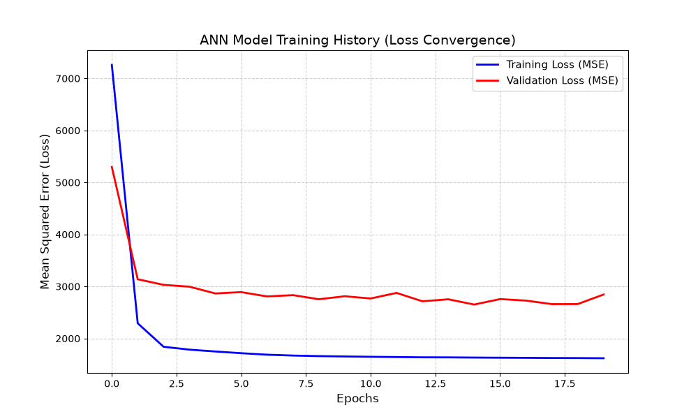

# Predictive Maintenance of Turbofan Engines using ANN

This repository implements a deep learning pipeline utilizing an **Artificial Neural Network (ANN)** to predict the **Remaining Useful Life (RUL)** of aircraft turbofan engines. The implementation is based on the simulated sensor degradation dataset provided by the **NASA C-MAPSS** (Center for AeroSpace Information) team.

---

## 🛠️ Project Architecture & Workflow

The project is structured into a clean, sequential pipeline inside `main.py`:

1. **Data Ingestion:** Loads raw multivariate time-series sensor texts (`train_FD001.txt`).
2. **Data Cleaning:** Identifies and drops constant flatline "dead sensors" (`setting_3`, `s_1`, `s_5`, etc.) providing zero variance.
3. **Feature Engineering (RUL Calculation):** Grouping engines by their deployment unit ID to mathematically derive the decreasing target variable ($RUL = \text{max\_cycle} - \text{current\_cycle}$).
4. **Feature Scaling:** Standardizes features using `MinMaxScaler` to restrict variations between 0 and 1 for optimal gradient updates.
5. **ANN Model Building:** Constructs a 3-layer feed-forward sequential neural network architecture using TensorFlow/Keras:
   * **Hidden Layer 1:** 32 Neurons, ReLU Activation
   * **Hidden Layer 2:** 16 Neurons, ReLU Activation
   * **Output Layer:** 1 Neuron, Linear Activation (Regression target)
6. **Model Training:** Fits the network over 20 epochs using the Adam optimizer and Mean Squared Error (MSE) loss metrics.
7. **Model Inference & Testing:** Evaluates real-time predictions against test data matrices (`test_FD001.txt`).
8. **Visualization:** Generates automated training log histories to plot error optimization curves.

---

## 📊 Training Results & Performance

The model tracks optimization progress dynamically across all epochs. Below is the training history tracking the reduction in prediction error:



* **Key Takeaway:** Both the training loss and validation loss decay uniformly without erratic divergence, confirming a stable convergence layout free of critical overfitting constraints.

---

## 🚀 How to Run the Implementation

Ensure you have Python installed alongside the required environment dependencies:

```bash
pip install pandas numpy scikit-learn tensorflow matplotlib